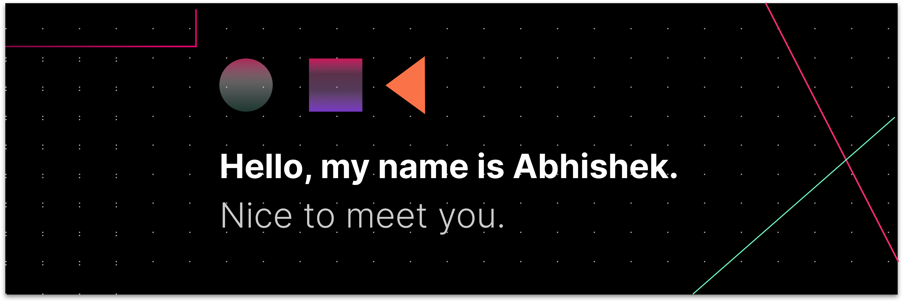

### Hi, I'm Abhishek Nagar 

---------------------------------------------------------------------------------------------------------------------------------------------------------------------------------

- 🎓 Undergraduate at NIT Bhopal, majoring in Mechanical Engineering
- 🔭 Currently I'm working on my projects
- 🌱 I’m currently learning Full stack
- 👯 I’m always ready to collaborate and contribute
- 📫 Have something to discuss: 
